<h1>Gestion des Patients avec Spring Security</h1>

Ce projet illustre le contrôle d'accès basé sur les rôles avec Spring Security, en utilisant trois modes d'authentification:

<ul>
    <li>Authentification In-Memory</li>
    <li>Authentification JDBC</li>
    <li>Authentification avec UserDetailsService</li>
</ul>

<h2>Authentification In-Memory</h2>

<h3>Configuration</h3>
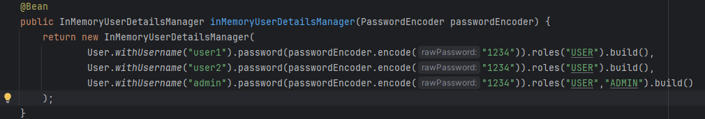

<h3>Résultat des Tests</h3>
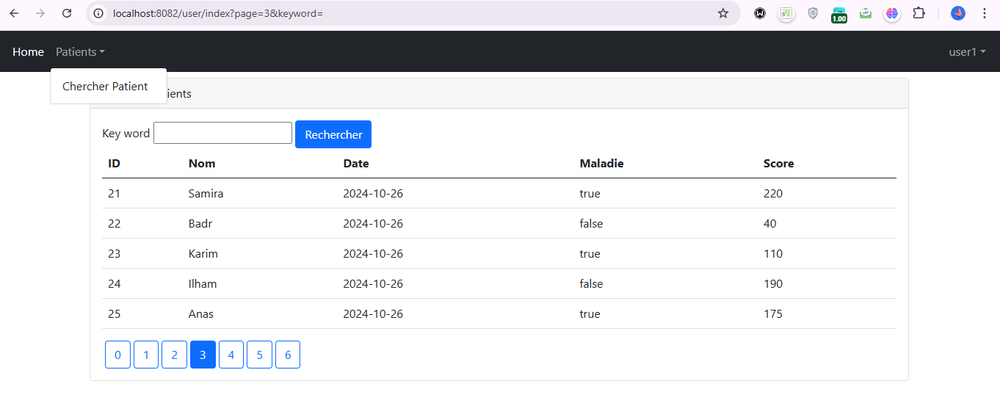

<h2>Authentification JDBC</h2>

<h3>Configuration</h3>
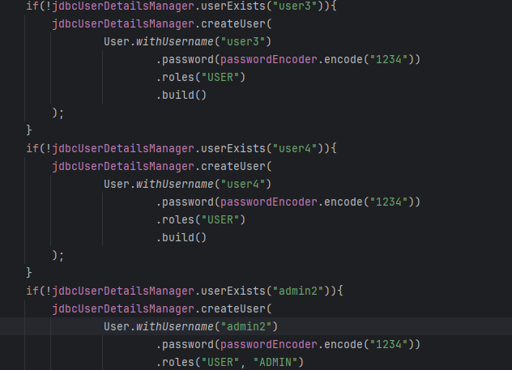

<h3>Base de Données Utilisateurs</h3>
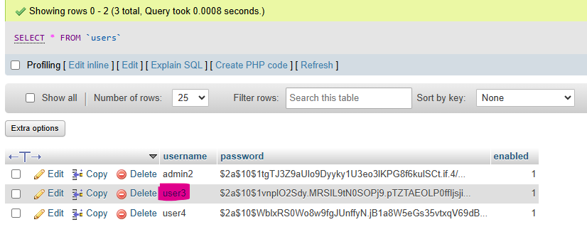

<h3>Résultat des Tests</h3>
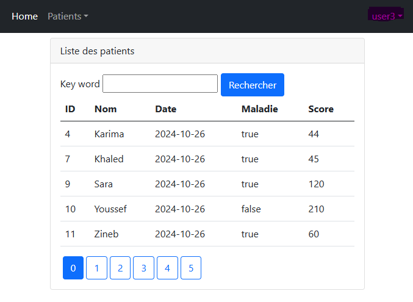

<h2>Authentification UserDetailsService</h2>

<h3>Configuration</h3>
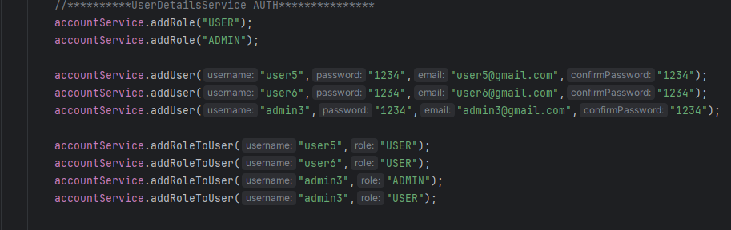

<h3>Base de Données Utilisateurs</h3>
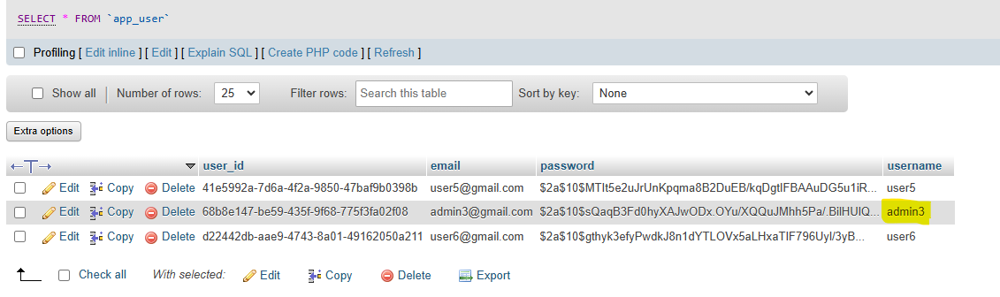

<h3>Résultat des Tests</h3>
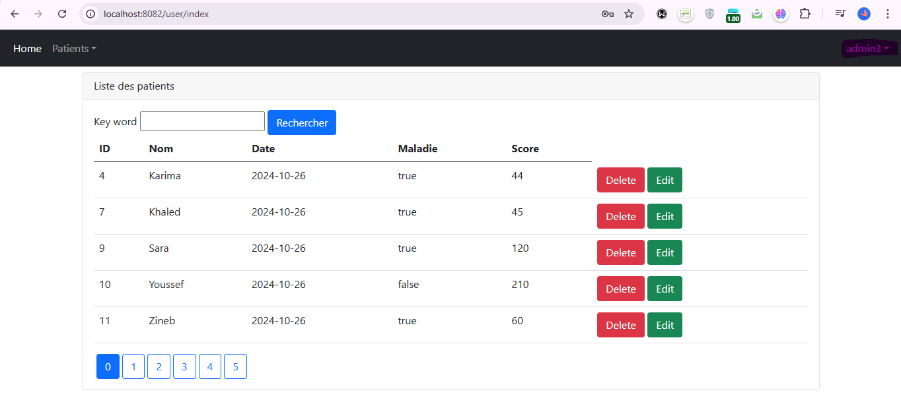

<h2>Interfaces Utilisateurs</h2>

<h3>Page de Connexion</h3>
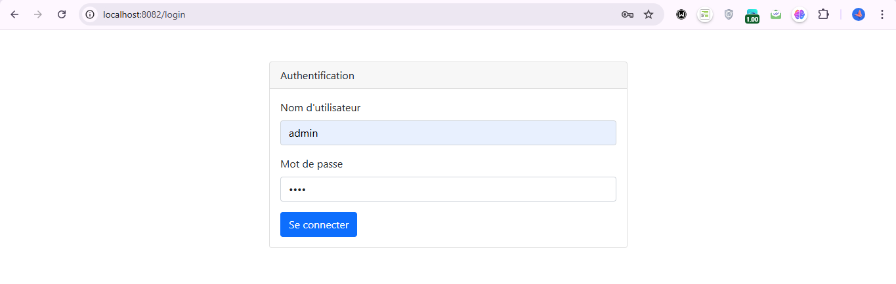

<h3>Vue Admin</h3>

L'administrateur peut consulter et gérer la liste des patients, y compris les supprimer ou les modifier.

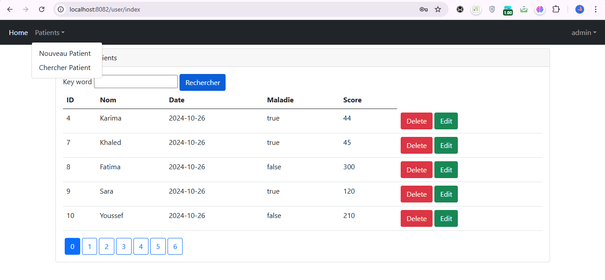

<h3>Vue Utilisateur</h3>

L'utilisateur peut consulter la liste des patients mais n'a pas accès à la suppression ou la modification.

<h3>Accès Refusé</h3>

Un utilisateur tentant d'accéder à des fonctionnalités réservées aux administrateurs, comme la suppression d'un patient, verra un message d'accès refusé.

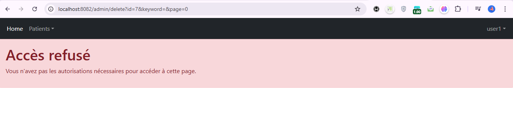

